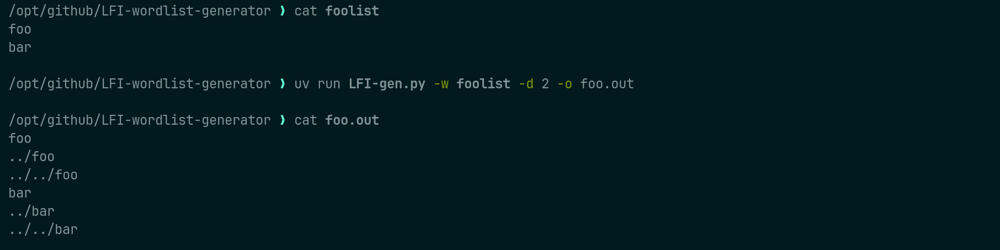
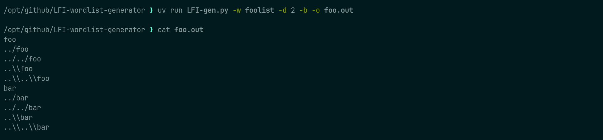
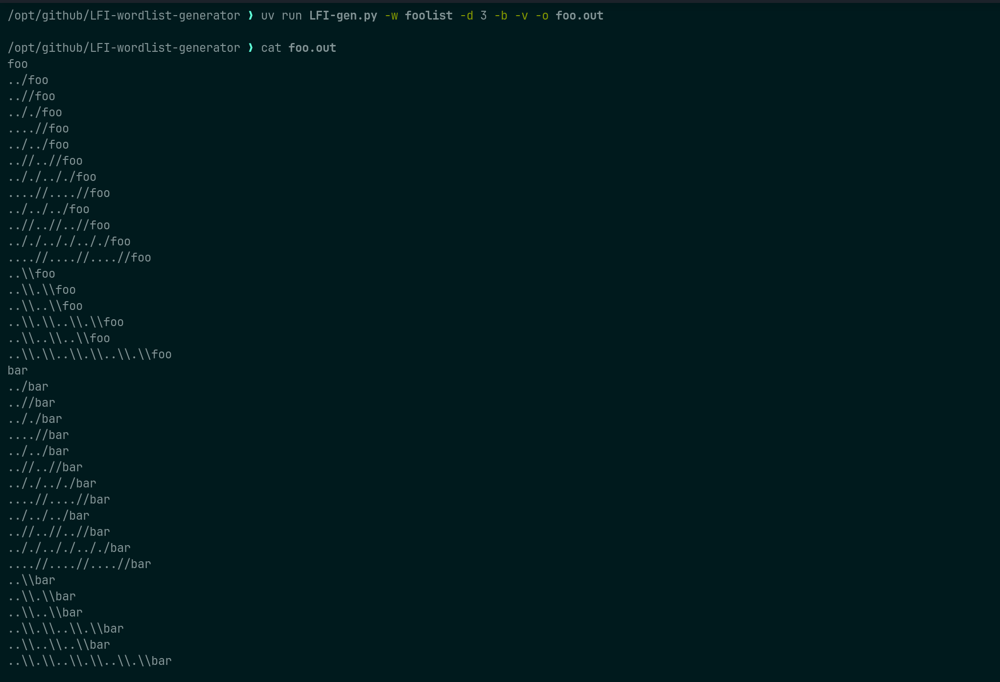

# traversal-wordlist-generator

Small Python utility to expand a wordlist with path traversal payloads.

# Options
```
  -w, --wordlist        wordlist
  -d, --depth           max traversal depth
  -o, --output          output file
  -v, --variants        add variants: ..//, .././, ....//
  -b, --backslash       also generate backslash variants like ..\foo
```

# Examples
Deep 2
```
uv run LFI-gen.py -w wordlist -d 2 -o wordlist.out
```

Deep 2 + backslash
```
uv run LFI-gen.py -w wordlist -d 2 -b -o wordlist.out
```

Deep 3 + backslash + extras path traversal like `....//`
```
uv run LFI-gen.py -w wordlist -d 2 -b -v -o wordlist.out
```

